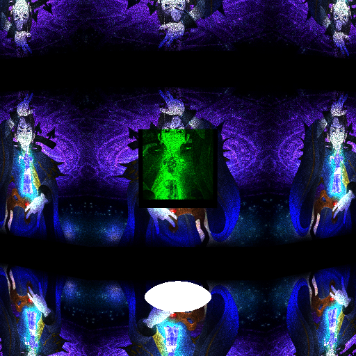
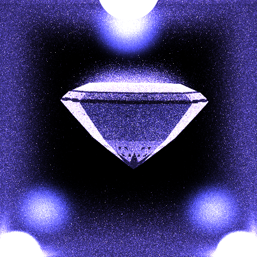
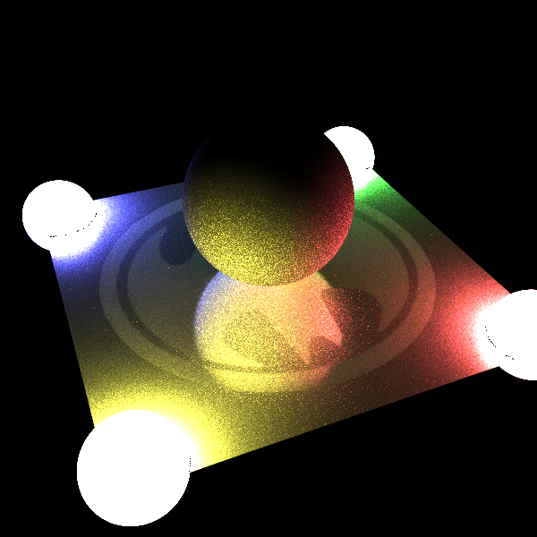
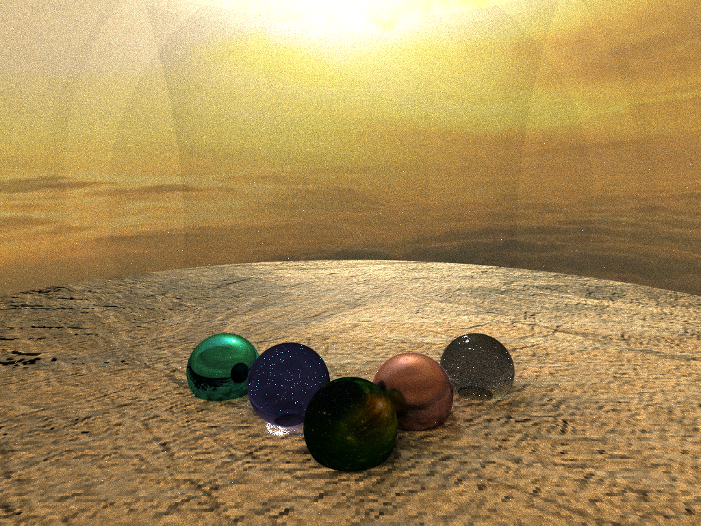
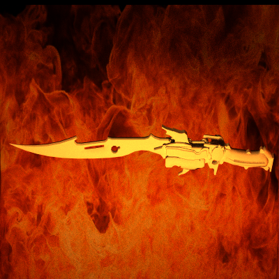
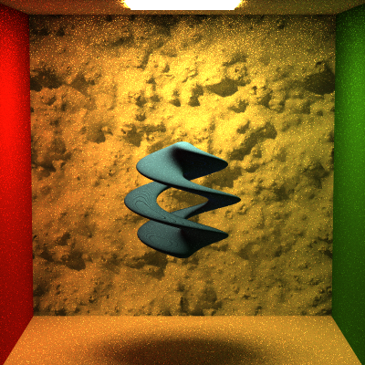

Path Tracer: Project of Advanced rendering
======================

**University of Pennsylvania, Advanced Computer Graphics**

**The code is implemented according to principle and source code of book "Physically Based Rendering: From Theory to Implementation, Third version", by Matt Pharr, Wenzel Jakob, and Greg Humphreys**

##Main features include:     
####Monte Carlo Path tracing 
####Multiple Importance Sampling
####Different Integrators, including Naive Integrator, Direct Light Integrator and FullLight Integrator
####Differenet BSDF Models,including Lambertian,Orennayar,Specular, Glossy, Transmission, and Microfacet
####Different Light sources, including arealight, pointlight, spotlight and distant light
####Acceleration Structure, including BVH tree and K-D Tree  
####Len-based Camera
####Implicit surface rendering

##Some rendering results:

#####Custome Scene 1        
          

            
#####Custome Scene 2                                     
      
            
#####Custome Scene 3                                     
               
              
#####Custome Scene 4                                     
            
            
#####Custome Scene 5                                     
     
         
#####Implicit Surface                                     
                
                   
#####Wahoo                                     
.png)                              
            
